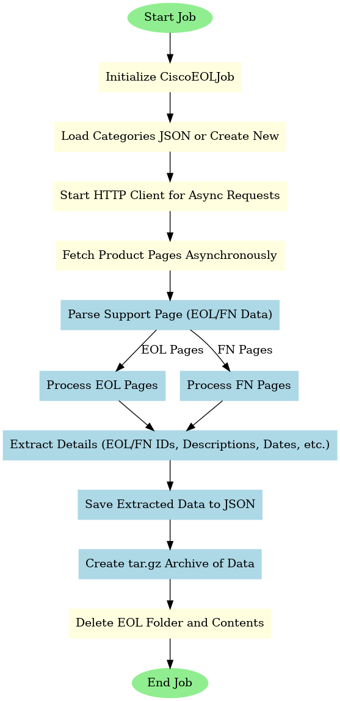
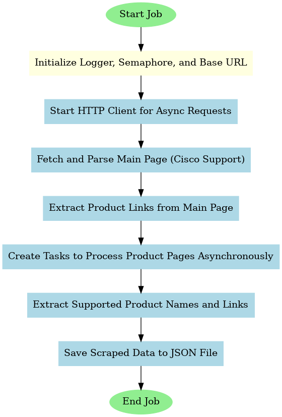
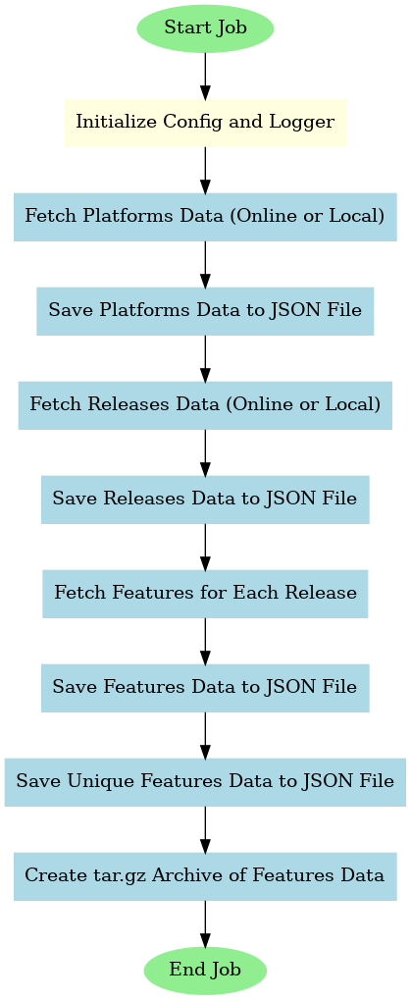

# Cisco Data Automation Project

### The Problem This Project Solves
Cisco provides Operational Insights (OI) through Network Consulting Engineers (NCE) or a customer portal, but this requires an onboarding process and an active subscription. This works well for existing customers, but what if you don’t want to go through all the formalities just to access important information like End of Life (EOL) dates, Common Vulnerabilities and Exposures (CVE), or best practices?

This data is already available on Cisco's website, but it's scattered all over the place. You can still manually search for device product IDs or software versions to find the information, but what if we could automate that process? This project aims to make your life easier by collecting and serving this data in a more organized and automated way.

### Consider This Scenario
You buy second-hand Cisco devices or inherit a network without active support contracts. You still need to generate reports, check for EOL dates, and evaluate vulnerabilities or features. While you can manually register each device and dig through Cisco's support website, it's a slow and tedious process.

### The Solution
This project offers a standalone REST API that provides support data for Cisco devices, even if they don’t have a support contract. With this API, you should be able to:

- Quickly check EOL dates, CVEs, features, recommendations, and config best practices for any Cisco device.
- Automate data updates through microservices without manual effort.
- Serve the data via a RESTful API that can be consumed by any other application or/and tool.
- Integrate Cisco device data into your analytics and reporting tools.
- Assess the impact of updates, like understanding how upgrading a device to the latest IOS version will affect security.
- Easily extend this tool to fetch data from other vendors (like F5, Palo Alto, Arista, etc.).

### Why an Open API Matters
This solution could help potential new Cisco customers.

By making support data accessible, it shows the value Cisco offers, potentially encouraging investment in new devices or support contracts.

However, the purpose here isn't marketing — it’s about helping people find useful, well-organized data or build their own tools on top of this one.

### No Reinventing the Wheel — Just Fetching, Organizing, and Serving Data
It’s important to understand that this project isn’t about stealing proprietary information. All the data being fetched is already publicly available on Cisco's website. This project just automates the process, providing the same information in a more efficient way.

The tools themselves don't violate Cisco’s policies, but how you use them might. So, make sure you're following Cisco's Terms of Service.

#### Note: This repository does not contain any scraped Cisco data — only tools that can gather it... :)

### Job Descriptions

1. **CiscoEOLJob**:

   - 
   - **What It Does**: CiscoEOLJob is responsible for scraping and processing Cisco's End-of-Life (EOL), End-of-Sale (EOS), and Field Notices (FN) data.
   - **How It Works**: It uses asynchronous HTTP requests to retrieve HTML pages from Cisco's website. It then parses these pages using BeautifulSoup to extract relevant information like product part numbers, milestone dates, and field notice details. The extracted data is saved to JSON files.
    
2. **GetCiscoProductsJob**:
   - 
   - **What It Does**: GetCiscoProductsJob is used to scrape product links from Cisco's support website and extract details about supported Cisco products.
   - **How It Works**: It uses an asynchronous HTTP client (`httpx`) to make requests to Cisco's product pages. The job parses the pages to extract product links, and then extracts supported products from each product page. The extracted data is saved to a JSON file.

3. **GetFeaturesJob**:
   - 
   - **What It Does**: GetFeaturesJob is responsible for fetching data related to Cisco platforms, software releases, and features. It collects information on supported features for different Cisco hardware platforms and software releases.
   - **How It Works**: This job first fetches platform data, then collects release information for each platform. Finally, it fetches features for each release. The data is fetched through Cisco APIs, and unique feature hashes are generated to track feature details. The collected data is saved to JSON files and archived as a `.tar.gz` file.

### Configuration Classes

1. **Config**:
   - **Description**: The base configuration class that defines the general setup for the project, such as the data directory and some Cisco URLs. This configuration is inherited by other job-specific configurations.
   - **Purpose**: It provides basic configuration properties and handles the setup of the project data directory, ensuring that paths are created when the configuration is instantiated.

2. **GetFeaturesConfig**:
   - **Description**: This class extends `Config` and provides configuration specific to the `GetFeaturesJob`. It includes options to control whether to fetch data online, the number of concurrent requests, and the delay between requests.
   - **Key Configurations**:
     - `HASHING_DIGEST` controls the length of the hash used for unique feature identification.
     - `CONCURRENT_REQUESTS_LIMIT` and `REQUEST_DELAY` determine request throttling to avoid getting blocked by Cisco.
     - Defines URLs for different Cisco APIs to fetch platforms, releases, and features.

3. **GetEOLConfig**:
   - **Description**: This class extends `Config` and provides configuration specific to the `CiscoEOLJob`. It defines various URLs and paths related to Cisco's EOL and EOS notices.
   - **Key Configurations**:
     - `CONCURRENT_REQUESTS` controls the number of requests that can be executed in parallel.
     - `DATA_REFRESH_INTERVAL` defines the interval (in seconds) after which the data is refreshed.
     - Configures archiving and paths for storing extracted EOL data.
